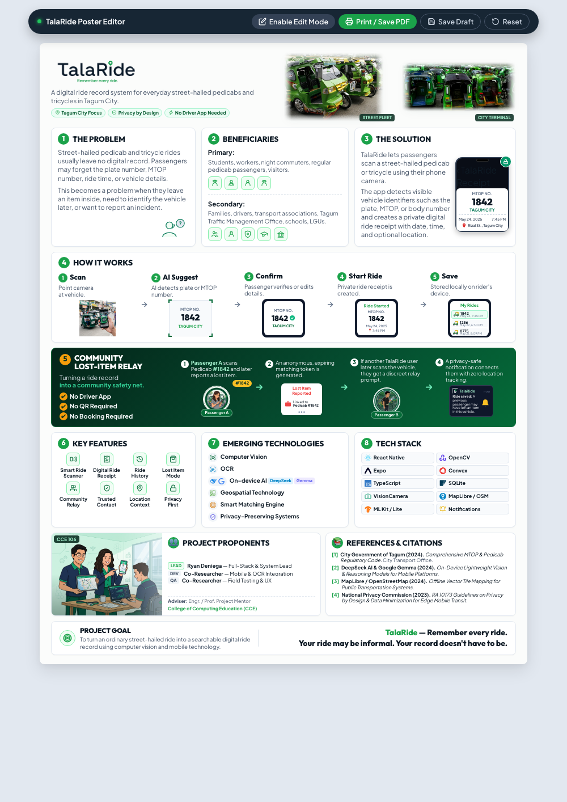

# TalaRide — Remember every ride.
### CCE 106 Academic Research Proposal Infographic Poster (Tagum City)

High-fidelity, pixel-crisp 1-Page A4 HTML/CSS infographic poster and interactive editor for **TalaRide**, a digital ride record and community relay system designed for street-hailed pedicabs and tricycles in Tagum City.

---

## 📸 Preview

---

## 🚀 Key Highlights & Architectural Strengths

1. **Zero Infrastructure & No Driver App Required**:
   * Works immediately with existing Tagum City MTOP markings on street-hailed pedicabs without requiring driver apps, hardware installations, or booking platform onboarding.
2. **AI-Assisted, Human-Verified Identification**:
   * On-device Computer Vision / OCR (OpenCV, DeepSeek, Google Gemma) detects the vehicle MTOP number with passenger verification before saving.
3. **Privacy by Design (RA 10173 Compliant)**:
   * Ride logs stay private on the passenger's local device (SQLite).
   * Community Relay uses anonymous, ephemeral matching tokens with auto-expiration (no continuous GPS tracking or vehicle surveillance).
4. **Authentic Tagum City Showcase**:
   * Features high-resolution photography and vector artwork of the actual green Tagum City pedicab fleet (`#2702`, `#0865`, `IVORY`, `0858`).
5. **Exact 1-Page A4 Precision**:
   * Calibrated strictly for standard A4 portrait print/PDF export without page-splitting.

---

## 📁 Repository Structure

| File / Folder | Description |
| :--- | :--- |
| **`standalone.html`** | **Single-file portable bundle** with embedded CSS, JS, and base64 assets. Double-click to open in any browser. |
| **`index.html`** | Modular semantic HTML5 structure. |
| **`style.css`** | Responsive stylesheet calibrated for high-DPI display and strict 1-Page A4 print media. |
| **`script.js`** | Interactive script enabling live in-browser editing (<kbd>Cmd+E</kbd>), local draft saving (<kbd>Cmd+S</kbd>), and reset. |
| **`assets/`** | High-resolution photography, vector logos, and custom UI illustrations. |
| **`poster_a4.pdf`** | Exported 1-Page A4 PDF poster ready for printing and academic defense. |
| **`preview.png`** | High-resolution full poster rendering preview. |

---

## 🛠️ How to Use & Customize

* **View in Browser**: Open `standalone.html` or `index.html` directly in Chrome, Safari, or Edge.
* **Edit Poster Content**: Click **"Enable Edit Mode"** (or press <kbd>Cmd</kbd> + <kbd>E</kbd>) to change any text or upload a new team group photo directly on the page.
* **Export PDF**: Click **"Print / Save PDF"** (or press <kbd>Cmd</kbd> + <kbd>P</kbd>) — set Margins to *None* and Background Graphics to *Checked*.
* **Save / Reset**: Click **"Save Draft"** to preserve customizations in browser memory, or **"Reset"** to restore default template.

---

## 👥 Project Proponents (CCE 106)
* **Ryan Deniega**
* **Kyndel Roy Suarez**
* **Domice Aseberos**
* **Anjelo Vidal**

**Institution**: College of Computing Education (CCE) — UMTC
